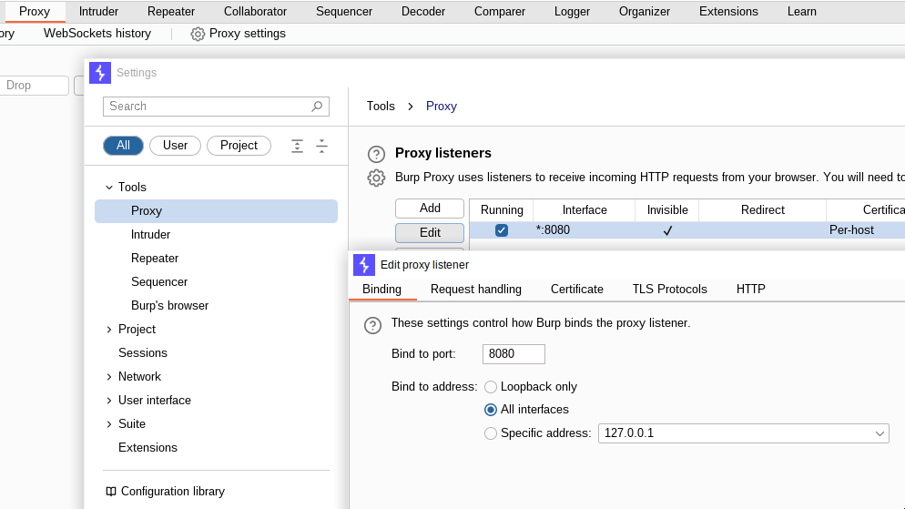
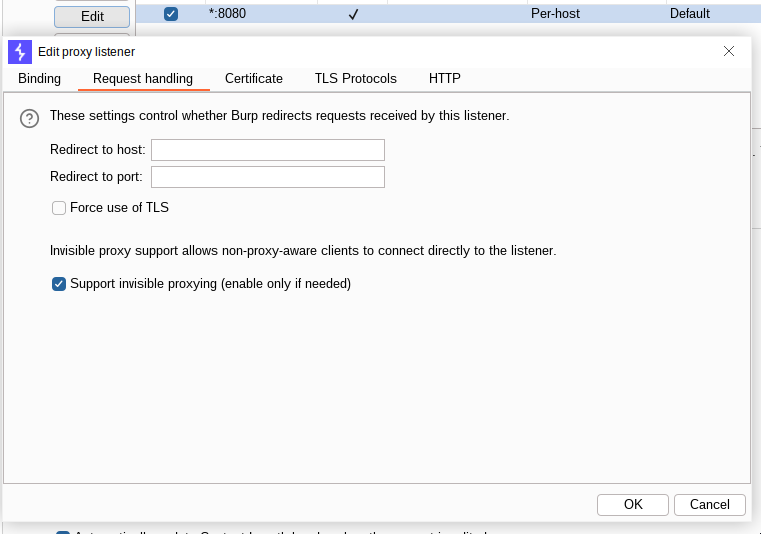

Saat melakukan uji penetrasi pada aplikasi Android, tentunya kita perlu melakukan Dynamic Testing, yang di mana senjata utama kita yaitu BurpSuite. Nah! untuk melakukan Capture Request di aplikasi Android itu memiliki Step yang lumayan panjang, salah satunya yang akan kita bahas di sini.

Sebelum kita memulai, alangkah baiknya kita perlu mempersiapkan aspek-aspek di bawah ini.
1. BurpSuite
2. ADB
3. Android Device (Root)

# Konfigurasi BurpSuite

Perlu dilakukan penyesuaian pada konfigurasi BurpSuite, dikarenakan Host (Android) yang akan kita Intercept itu berbeda dengan Host milik BurpSuite, maka konfigurasi yang perlu disesuaikan terletak pada `Proxy` > `Proxy settings` > `Proxy Listeners`, yang di mana `Bind address` perlu diubah menjadi `All Interfaces` agar dapat di-listen oleh Device di luar Host (milik BurpSuite itu sendiri) melalui mekanisme Remote Proxy.



Sebagai opsional, maka kita juga dapat mengubah konfigurasi `Request handling` agar support `invisible proxy` (jika diperlukan).



# Penyesuaian BurpSuite Certificate

Instalasi sertifikat BurpSuite di Android System itu memerlukan koneksi dari Computer ke Android dan Tool yang akan kita gunakan yaitu ADB. Untuk mengkoneksikan ADB dan Android Device dapat dilakukan dengan 2 cara, yaitu:

1. via Network (TCP)
2. via USB

Untuk tutorialnya, itu sudah sangat banyak di internet dan sangat bervariasi berdasarkan jenis Handphone-nya.

Hal ini akan kita lanjutkan dengan anggapan bahwa, ADB (pada komputer) dan Android sudah berhasil terkoneksi.

1. Download BurpSuite Certificate dengan command CURL
```
curl -s --proxy "http://127.0.0.1:8080" "http://burp/cert" -o burpsuite.der
```
<br>
2. Konversikan file .DER ke .PEM
```
openssl x509 -inform DER -in burpsuite.der -out burpsuite.pem
```
<br>
3. Menyalin file .PEM dan mengubah nama file dengan format Subject Hash
```
cp burpsuite.pem $(openssl x509 -inform PEM -subject_hash_old -in burpsuite.pem | head -1).0
```

# Instalasi Certificate pada Android System

Jika file .PEM sudah berhasil dibuat, kita masuk pada bagian instalasi sertifikat (.PEM) di Android System.

1. Inisiasi agar Storage dapat di-input dengan file
```
adb root
adb remount
```
<br>
2. Copy file .PEM dari Computer ke dalam Android (SDCard)
```
adb push $(openssl x509 -inform PEM -subject_hash_old -in burpsuite.pem | head -1).0 /sdcard/
```
<br>
3. Konfigurasi File System agar Writable
```
echo -n "mount -o rw,remount /" | adb shell
```
<br>
4. Memindahkan file .PEM ke dalam direktori system
```
echo -n "mv /sdcard/$(openssl x509 -inform PEM -subject_hash_old -in burpsuite.pem | head -1).0 /system/etc/security/cacerts" | adb shell
```
<br>
5. Mengubah Attribute dan Permission pada file .PEM agar dikenali oleh System
```
echo -n "chmod 644 /system/etc/security/cacerts/$(openssl x509 -inform PEM -subject_hash_old -in burpsuite.pem | head -1).0" | adb shell
echo -n "chown root:root /system/etc/security/cacerts/$(openssl x509 -inform PEM -subject_hash_old -in burpsuite.pem | head -1).0" | adb shell
```
<br>
6. Mengembalikan konfigurasi File System (root) ke awal
```
echo -n "mount -o ro,remount /" | adb shell
```
<br>
7. Reboot Android Device
```
echo -n "reboot" | adb shell
```