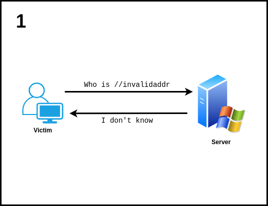
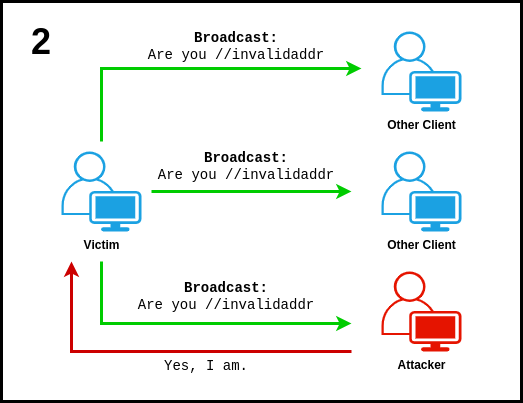
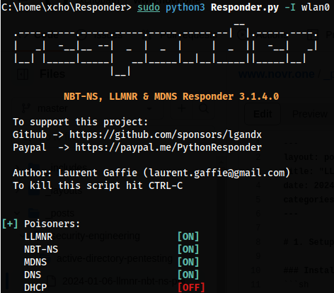
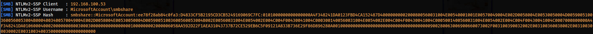
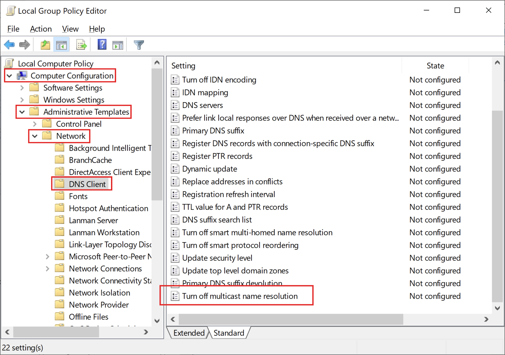
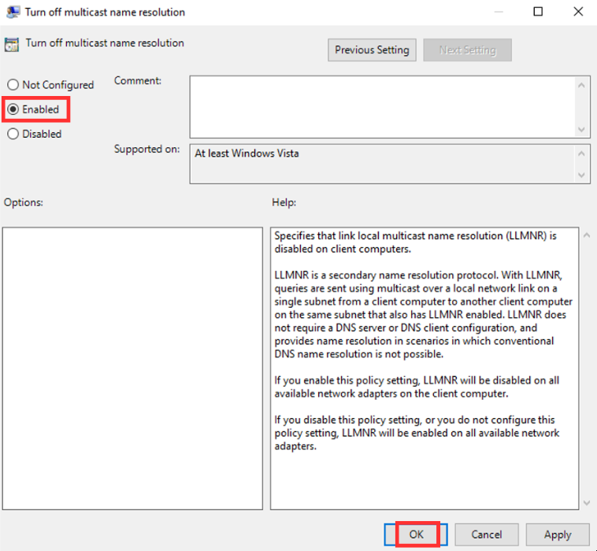
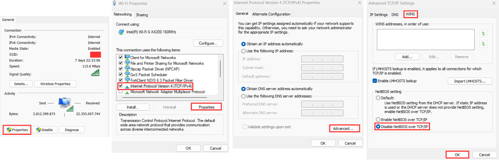

Sebelum kita masuk ke dalam pembahasan teknis terkait serangan Poisoning ini, alangkah baiknya kita harus mengenal juga apa itu LLMNR, NBT-NS, dan mDNS.

Di dalam komputer Windows, LLMNR (Link-Local Multicast Name Resolution) digunakan untuk menemukan alamat IP dari nama host (hostname) di dalam jaringan lokal komputer itu sendiri (tanpa bergantung kepada server DNS), sementara NBT-NS (NetBIOS Name Service) berfungsi untuk mengonversi nama NetBIOS menjadi sebuah alamat IP.

Namun pada tahun 2022, Microsoft melakukan pemberhentian secara bertahap terkait LLMNR dan NBT-NS dan digantikan dengan mDNS (Multicast DNS). Namun secara garis besar, mDNS juga memiliki konsep yang sama, yaitu protokol (komputer) yang digunakan untuk melakukan resolusi hostname di dalam jaringan lokal komputer itu sendiri tanpa bergantung dengan DNS Server terpusat.

Dalam serangan Poisoning ini, tentunya kita akan mengeksploitasi konsep dari ketiganya.

Nah! Di sini akan saya berikan sedikit analogi dari konsep Local DNS di atas.

Broadcast:

> Halo semuanya **(10.10.10.0/24)**, apakah di sini ada komputer yang bernama **rio**?

Jika hostname yang terpanggil itu ada:

> Ya! Saya **rio** dari **(10.10.10.150)**, ada apa ya?

Namun, jika tidak ada, maka komputer yang melakukan Broadcast tidak akan mendapat jawaban dari komputer mana pun.

## How is it work?

Nah! Di sinilah letak berbahayanya, karena pada dasarnya Attacker dapat berpura-pura menjadi komputer yang tidak diketahui keberadaannya tersebut.






Semoga dari gambaran di atas, teman-teman sudah bisa membayangkan alur serangan Poisoning yang sedang kita bahas.

Sebagai contoh kasus di sini, serangan Poisoning ini dapat dimanfaatkan oleh penyerang untuk mencuri sebuah Credential, misalnya seperti NTLMv2.

<h1 class="header-group">Proof of Concept</h1>
# 1. Create Listener to Capture

Install `Responder`.
```
git clone https://github.com/lgandx/Responder
cd Responder/
pip3 install -r requirements.txt
```
<br>
Jalankan `Responder` (sebagai Listener atau Service palsu).
```
sudo python3 Responder.py -I <network interface>
```


<br><br>
Tunggu hingga komputer korban melakukan interaksi ke `Responder`.

Jika berhasil, maka `Responder` akan Capture hasil dari interaksinya (misalnya seperti NTLMv2 Hash).



# 2. Remediation

### Disable LLMNR (Link-Local Multicast Name Resolution) melalui Group Policy

1. Gunakan `Windows + R` kemudian input keyword `gpedit.msc`
2. Masuk ke dalam menu `Computer Configuration` > `Administrative Templates` > `Network` > `DNS Client`
3. Kemudian Double Click pada bagian `Turn off multicast name resolution`
4. Setelah itu pilih `Enabled` dan `OK`





### Disable NBT-NS (NetBIOS Name Service) melalui LAN Settings

- Buka konfigurasi Network Connections, dapat dilakukan dengan cara tekan `Windows + R` dan input `ncpa.cpl`
- Pilih Network Adapter dan klik kanan pada Network Adapter yang digunakan



- Kemudian tekan tombol `Properties`
- Ketika sudah mengakses Properties, menuju menu `Internet Protocol Version 4 (TCP/IPv4)` atau `Internet Protocol Version 6 (TCP/IPv6)` (disesuaikan dengan konfigurasi Network yang terimplementasi), setelah itu tekan tombol `Properties`
- Jika sudah, langsung menuju tombol `Advanced...`
- Ketika sudah membuka menu Advanced TCP/IP Settings, langsung menuju tab `WINS` dan pilih opsi `Disable NetBIOS over TCP/IP`
- Jika sudah, maka tekan `OK`

### Disable mDNS melalui Registry

1. Buka Windows Registry Editor
2. Menuju ke `HKLM\SYSTEM\CurrentControlSet\Services\Dnscache\Parameters`
3. Buat sebuah `DWORD` dengan nama `EnableMDNS` dan value `0`