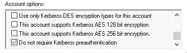
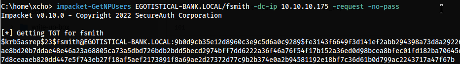
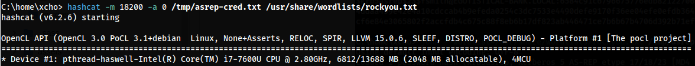
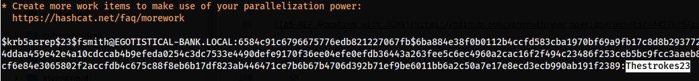

Di dalam serangan AS-REP Roasting, penyerang akan menargetkan protokol Kerberos untuk mengekstraksi Domain User yang rentan karena menonaktifkan Kerberos Preauthentication. Terjadinya miskonfigurasi ini disebabkan karena opsi **Do not require Kerberos preauthentication** diaktifkan.



Pada skenario ini, penyerang akan meminta Ticket pengguna yang rentan dari Authentication Service (AS) milik protokol Kerberos. Ticket yang berhasil diperoleh pada dasarnya menyimpan kredensial milik pengguna tersebut, tetapi kredensial itu terenkripsi dalam bentuk Hash.

Bermodalkan Ticket yang sudah diperoleh, penyerang dapat mencoba untuk membongkar Hash tersebut secara **Offline**. Jika Hash-nya berhasil di-crack, maka penyerang dapat Login menggunakan kredensial pengguna tersebut.

## Nice to Know

Sebelum kita lanjutkan, di dalam Key Distribution Center (KDC) pada protokol Kerberos di lingkungan Active Directory, terdapat dua layanan utama:

1. Authentication Service (AS) 
2. Ticket-Granting Service (TGS)

Yang akan kita manfaatkan untuk melakukan AS-REP Roasting adalah layanan Authentication Service (AS), dan AS-REP adalah singkatan dari **Authentication Service Reply**, yang di mana isi dari AS-REP itu sendiri adalah sebuah Ticket yang biasa disebut sebagai TGT (Ticket Granting Ticket).


Sebagai catatan kecil, protocol **Kerberos** biasanya terletak dan menyatu dengan mesin Domain Admin, serta Port yang digunakan itu biasanya `Port 88`.

> **Kerberos Protocol** => **Port 88**

<h1 class="header-group">Proof of Concept</h1>
# 1. Capture the AS-REP

Sebagai contoh, di sini kita akan menggunakan modul dari `Impacket` untuk melakukan permintaan pada Authentication Service (AS).

**Installation**
Linux (Debian Based):
```
sudo apt install pipx -y
sudo python3 -m pipx install impacket
```

Kali Linux:
```
sudo apt install impacket-scripts -y
```

Atau kalian juga bisa menyesuaikan instalasinya dengan cara mengunjungi Repository <https://github.com/fortra/impacket>.

Jika sudah terinstal, kita bisa menggunakan modul `GetNPUsers.py` dari `Impacket` untuk mendapatkan AS-REP melalui Kerberos dan menargetkan pengguna yang menonaktifkan Preauthentication.

**Command**
```
impacket-GetNPUsers <domain>/<user> -dc-ip <ip domain controller> -request -no-pass
```



- **Note:** "fsmith" is a user that has no preauthentication.

## Alternative Tool
Selain menggunakan `Impacket`, kalian juga bisa menggunakan tool `Rubeus.exe` sebagai alternatif bilamana environment yang kalian gunakan untuk Pentest itu berbasis Windows.

Download `Rubeus.exe`:
- <https://github.com/GhostPack/Rubeus>

**Command**
```
Rubeus.exe asreproast /outfile:hashes.txt /format:hashcat [/user:USER] [/domain:DOMAIN] [/dc:DOMAIN_CONTROLLER]
```


# 2. Roasting (Crack the Ticket)

Setelah mendapatkan Ticket, kita masuk ke bagian selanjutnya yaitu Roasting. Pada tahap ini kita dapat menggunakan Tool untuk melakukan Password Cracking seperti `hashcat` atau `john`. Fungsi Tool ini nantinya untuk melancarkan Brute Force pada Hash yang kita dapatkan yang tersimpan di dalam Ticket.

## John
Untuk penggunaan tool `john`, kita perlu memasukan 2 parameter file, yaitu file hasil dari AS-REP yang kita dapatkan dan file yang berisi list password. Untuk file password-nya kalian bisa menggunakan wordlist dari `rockyou.txt`.

**Command**
```
john --wordlist=<password file> <as-rep file>
```


## Hashcat (alternative)
Selain menggunakan `john`, kita juga dapat menggunakan `hashcat` untuk melakukan Hash Cracking sebagai Tool alternatif dan kalau boleh jujur, saya pribadi lebih sering menggunakan `hashcat`.

**Command**
```
hashcat -m 18200 -a 0 <as-rep file> <password file>
hashcat -m 18200 -a 0 <as-rep file> <password file> --show
```




